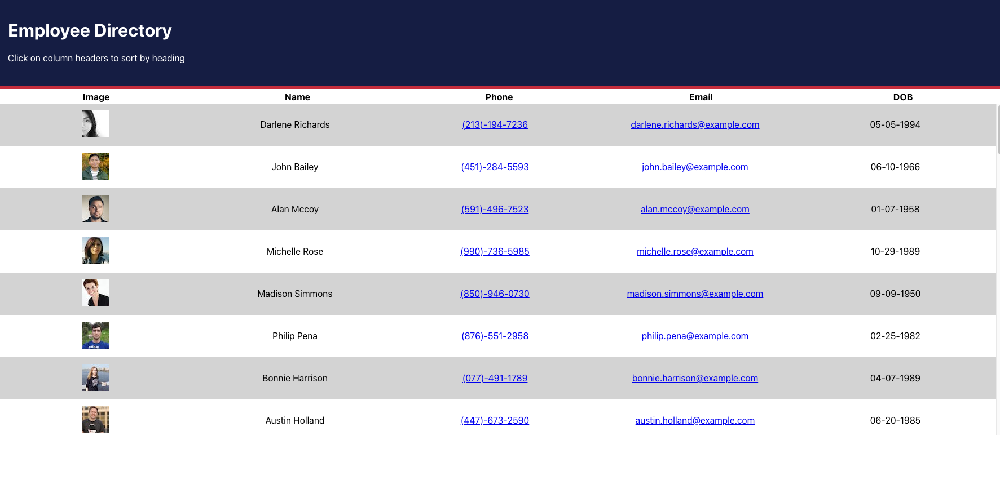

# Employee Directory React App

## Description

This React application is a directory of employees that are randomly generated using the [randomuser.me API](https://randomuser.me). It allows the user to view their entire employee directory at once so they can have quick access to their employee's information.



## Installation

Use one of the following code snippets to install the necessary dependencies:

```
npm install
```
or 

```
yarn add
```

## Usage

Clone/fork my repo and install the necessary dependencies. Start the server by running either `npm start` or `yarn start` and view the application in your browser on `http://localhost:3000`. You can determine whether yo use npm or yarn by looking at your .lock file. If it says `yarn.lock` then use yarn otherwise use npm.

[Here](https://jhohing.github.io/employee-directory/) is a link to my deployed app, which I deployed on GitHub Pages.

## Contributing
[Justin Hohing](https://github.com/jhohing)

## Questions
Contact me with any questions: [email](mailto:jnh0627@yahoo.com) , [GitHub](https://github.com/jhohing)<br />

